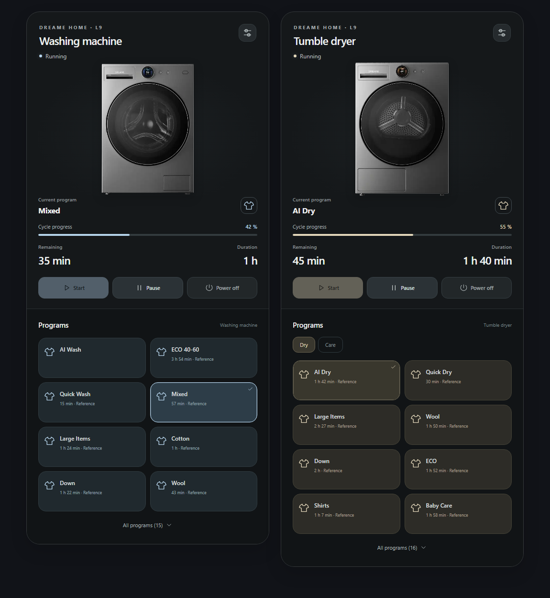

# Dreame Home Laundry for Home Assistant

Connect your Dreame Washing Machine L9 and Twin Inverter Dryer L9 to Home Assistant through your Dreame Home account.

**Dreame Home Laundry** provides appliance status, useful cycle sensors, program selection, controls, and a bundled laundry dashboard card. Appliances are discovered automatically from your account. You do not need to find device IDs or configure an MQTT broker.

## Features

- **Primary laundry entity:** each appliance's Operation state sensor includes its current program, phase, timing, estimated progress, and settings as attributes.
- **Cycle sensors:** active program, remaining time, program duration, estimated finish time, program progress, and elapsed time for dashboards and automations.
- **Appliance controls:** program selection, supported settings, and separate start/resume, pause, and stop buttons.
- **Organized device pages:** everyday settings under Controls, cycle information under Sensors, and connection details under Diagnostic.
- **App-aligned programs:** 15 standard washer programs and 25 dryer programs, including 16 drying programs and 9 care programs.
- **Laundry dashboard card:** washer and dryer product images, an animated drum while running, cycle information, and controls with a visual editor.
- **English interface:** entity names, program choices, and card text stay in English regardless of your Home Assistant language.
- **Live updates:** cloud reads and optional MQTT updates, with additional telemetry exposed as it becomes available.

## Supported devices

| Device | Cloud model | Features |
| --- | --- | --- |
| Dreame Washing Machine L9 | `dreame.washer.l9nacn` | Laundry sensors, program selection, settings, and cycle controls |
| Dreame Twin Inverter Dryer L9 | `dreame.dryer.l9nacn` | Laundry sensors, drying/care programs, settings, and cycle controls |

The integration supports the two L9 models listed above. Features and reported sensors can vary with firmware.

Current version: **0.4.0b9 — beta**. Requires **Home Assistant Core 2026.9.4 or newer** and an internet connection to the Dreame cloud.

## Install with HACS

1. In **HACS**, open the menu and select **Custom repositories**.
2. Add `https://github.com/Ampersandman/Dreame-Home-Laundry` with type **Integration**.
3. Download **Dreame Home Laundry** and restart Home Assistant.
4. Open **Settings → Devices & services → Add integration → Dreame Home Laundry**.
5. Enter your Dreame Home account credentials and select the server region used in the app. Leave live MQTT updates enabled for the most complete telemetry.

Your devices will appear under the integration. The password is used to sign in; Home Assistant stores a refresh token for subsequent connections.

[Full installation and update guide](docs/installation.md)

## Add the laundry card

*Preview with sample values.*

The card is included with the integration and loads automatically. Edit a dashboard, choose **Add card**, and select **Dreame Home Laundry**. Use the visual editor to select your washer or dryer and its entities.

Program selection and **Start** are separate actions. Choosing a program does not start the appliance.

[Dashboard card setup and examples](docs/dashboard-card.md)

## User guides

| Guide | What it covers |
| --- | --- |
| [Installation](docs/installation.md) | HACS setup, account connection, and updates |
| [Entities and controls](docs/entities.md) | Sensors, programs, settings, and control availability |
| [Dashboard card](docs/dashboard-card.md) | Visual editor, card options, and YAML examples |
| [Automations](docs/automations.md) | Notifications and examples using Home Assistant actions |
| [Troubleshooting](docs/troubleshooting.md) | Sign-in, unavailable devices, card loading, and privacy |

Controls require the device to be online and to report recent usable state. Some settings are available only for particular programs or cycle phases. Home Assistant shows confirmed appliance state after updates; it does not assume that a submitted command succeeded.

L9 appliances automatically power off after use and may then appear offline in Dreame Home and Home Assistant. Switch an appliance on at its panel before using controls; the integration checks offline L9 devices about once a minute for their return online. See [automatic power-off and offline appliances](docs/troubleshooting.md#appliances-go-offline-after-a-cycle).

Appliance scheduling is not provided by this integration.

## Support

For help, check the [troubleshooting guide](docs/troubleshooting.md) or [open an issue](https://github.com/Ampersandman/Dreame-Home-Laundry/issues). Include the integration version, Home Assistant version, device model, and a description of the problem. Review diagnostics and logs before sharing them, and keep account credentials private.

This is a community integration and is not affiliated with Dreame. See [LICENSE](LICENSE) and [third-party notices](THIRD_PARTY_NOTICES.md) for licensing and attribution.
